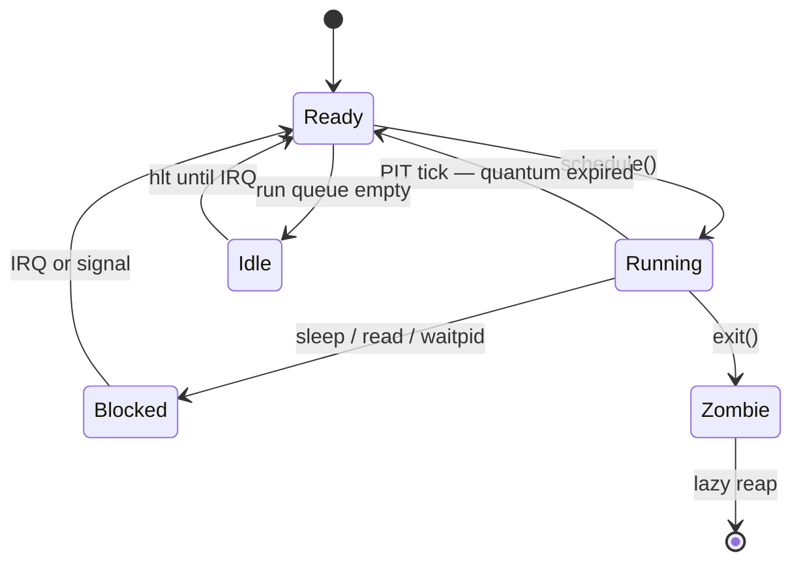
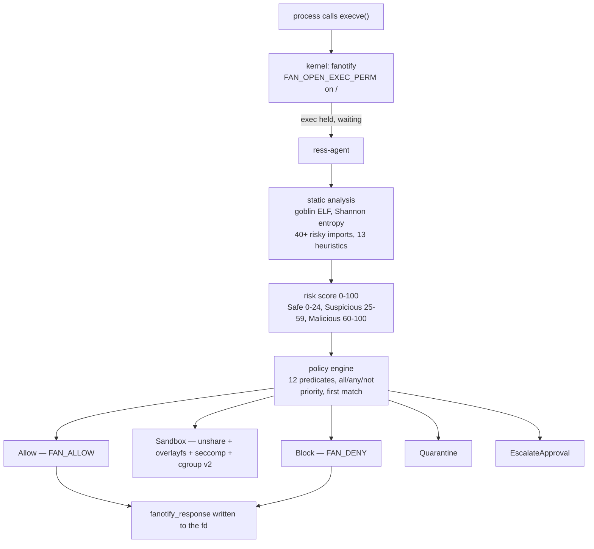

<h2 align="center">mcss</h2>

<p align="center">
  <i>Kernels, compilers, and the layer that decides which binaries are allowed to run.</i>
</p>

<p align="center">
  <a href="https://d3lta2033.nl"></a>
  <a href="https://venoly.nl"></a>
</p>

I write low-level software: an i686 kernel with no libc, a systems language and its
compiler, an execution firewall that gates `execve` from userspace, and a hardening
wizard that generates bash you can take back out again. Mostly C, C++ and Rust.

Line counts come from `wc -l` on a clean clone; language bytes are GitHub's Linguist
figures; the Venoly sizes were measured over the wire. Where something is unfinished
or broken, it says so.

---

## Measured

Counted with `find | xargs wc -l` on a clean clone. Nothing vendored, generated or
bundled is included in any figure.

```
aether             16,419   C++23     compiler front to back, 101 files in src/
AstraOS            12,740   C + NASM  i686 kernel, no libc, ring 0 -> ring 3
secureforge         9,666   JS (ESM)  99 files, 23 hardening modules, 9 distros
ModularX            7,579   6 langs   19 small libraries + a JS orchestrator
RESS                4,430   Rust      10-crate workspace, fanotify exec firewall
hvc                 4,039   C23       C -> IR compiler + VM (does not build)
Security-Recovery   3,474   C         firmware recovery state machine
SCSA                1,151   C         one translation unit: tokenizer -> VM
ai-rofi-launcher    1,098   Go        local AI server with an embedded web UI
kittybrain            325   Python    302M-param char-level GPT, from scratch
archcraft-full-upg    223   Bash      22-pass Arch maintenance script
                  ───────
                   61,144   lines
```

A few of these carry a second language that is not in the column: 984 lines of Python
CLI in Security-Recovery, 712 lines of Bash under ai-rofi-launcher.

---

## Languages, by measured bytes

GitHub's per-language byte counts across my own repositories, forks excluded. These
are Linguist's numbers, so a share of the Makefile and CMake rows is generated build
output rather than hand-written — see the by-commit card below, which does not have
that problem.

```
LANGUAGE            BYTES   SHARE - one block = 1%              PCT
───────────────────────────────────────────────────────────────────
C                 751,494   ██████████████████████████████▉  30.81%
C++               733,748   ██████████████████████████████▏  30.09%
JavaScript        416,810   █████████████████▏               17.09%
Rust              159,061   ██████▌                           6.52%
Python             86,370   ███▌                              3.54%
Makefile           76,925   ███▏                              3.15%
HTML               53,409   ██▎                               2.19%
Shell              52,704   ██▏                               2.16%
Ruby               31,144   █▎                                1.28%
CMake              28,079   █▏                                1.15%
Go                 25,445   █                                 1.04%
Assembly           21,067   ▉                                 0.86%
Linker Script       1,956   ▏                                 0.08%
TypeScript            366                                     0.02%
Batchfile             248                                     0.01%
───────────────────────────────────────────────────────────────────
total           2,438,826                                   100.00%
```

C and C++ together are 60.9% of every byte. By **commit** volume the mix reads
`C · Shell · C++ · Rust · Python` — the JavaScript share above is one hardening
wizard and one library collection, and it compresses away the moment you count
changes instead of characters.

**Where the bytes come from — every language traced to a project:**

| Language | Concentrated in | Doing what |
| --- | --- | --- |
| **C** | AstraOS, SCSA, hvc, Security-Recovery | Kernel and drivers, a single-file compiler+VM, a firmware state machine |
| **C++** | aether, ModularX | A compiler front to back, plus cache and logger libraries |
| **Rust** | RESS, ModularX | A 10-crate fanotify execution firewall, plus a small async cache crate |
| **JavaScript** | secureforge, ModularX, SmartRateLimiter | A 99-file hardening wizard, a cross-language library collection, a rate limiter |
| **Assembly** | AstraOS, ModularX | 412 lines of NASM for boot, ISRs and ring switches; 564 lines of x86-64 bit/SIMD utilities |
| **Python** | kittybrain, Security-Recovery, ModularX | Transformer training, a PAM-authenticated CLI, async utilities |
| **Shell** | archcraft-full-upg, ai-rofi-launcher, secureforge | System maintenance, multi-distro installers |
| **Go** | ai-rofi-launcher | A localhost AI proxy with the web UI compiled into the binary |
| **HTML** | mcss, ai-rofi-launcher | One hand-written 894-line landing page; one 467-line self-contained web UI compiled into a Go binary |

<p align="center">
<picture>
  <source media="(prefers-color-scheme: dark)" srcset="https://github-profile-summary-cards.vercel.app/api/cards/repos-per-language?username=D3LTA2033&theme=tokyonight">
  <source media="(prefers-color-scheme: light)" srcset="https://github-profile-summary-cards.vercel.app/api/cards/repos-per-language?username=D3LTA2033&theme=github">
  
</picture>
<picture>
  <source media="(prefers-color-scheme: dark)" srcset="https://github-profile-summary-cards.vercel.app/api/cards/most-commit-language?username=D3LTA2033&theme=tokyonight">
  <source media="(prefers-color-scheme: light)" srcset="https://github-profile-summary-cards.vercel.app/api/cards/most-commit-language?username=D3LTA2033&theme=github">
  
</picture>
</p>

---

## Detail

<details>
<summary><b>AstraOS</b> — 12,740 hand-written lines, no libc, its own GUI and its own language · <a href="https://github.com/D3LTA2033/AstraOS">repo</a></summary>

<br>

10,289 lines of C across 35 files, 2,039 lines of headers across 36, and 412 lines
of NASM across 7. Nothing vendored, nothing generated. All 32 kernel translation
units and all 3 userland programs compile clean under
`-m32 -std=c11 -ffreestanding -fno-builtin -nostdlib -Wall -Wextra -Werror -O2` —
32 of 32, zero failures.

The only system headers anywhere in `kernel/`, `include/`, `arch/` or `user/` are the
three the compiler itself provides: `<stdint.h>`, `<stddef.h>`, `<stdbool.h>`.
`kstrlen`, `kmemcpy` and friends are hand-rolled in `kernel/lib/kstring.c`.

**Address space.** Real x86 two-level paging — 1024-entry page directory and page
tables, `PAGE_USER` on ring-3 pages, physical frames from a bitmap allocator that
walks the GRUB multiboot memory map. `pmm.c` 220 lines, `vmm.c` 301, `kheap.c` 211,
`page_fault.c` 72.

```
 0xC000_0000  ┌────────────────────────────┐  kernel heap base   kheap.c
              │  kernel heap               │
              ├─ ─ ─ ─ ─ ─ ─ ─ ─ ─ ─ ─ ─ ──┤
              │  ~3 GiB unmapped        ⋮  │  not to scale
              ├─ ─ ─ ─ ─ ─ ─ ─ ─ ─ ─ ─ ─ ──┤  _kernel_end        linker.ld
              │  .text .rodata .data .bss  │
 0x0010_0000  ├────────────────────────────┤  1 MiB, Multiboot 1 load address
              │  low memory / BIOS area    │
 0x0000_0000  └────────────────────────────┘
```

`boot.asm` carries a Multiboot 1 header that asks GRUB for a 1024×768×32 linear VESA
framebuffer. `linker.ld` places the kernel at 1 MiB with 4 KiB-aligned sections and
exports `_kernel_end` for the allocator.

**Ring transition.** `usermode.asm` hand-builds an `IRET` frame with `SS = 0x23` and
`CS = 0x1B` — RPL 3, interrupts re-enabled. `context_switch.asm` is a genuine
callee-saved switch over `EFLAGS / EDI / ESI / EBX / EBP` plus an `ESP` handoff.
`isr.asm` generates 48 stubs: 32 CPU exception entries (23 without an error code,
9 with) and 16 IRQ entries.

**Scheduler.** Preemptive round robin, 50 ms quantum (5 PIT ticks at 10 ms), an idle
task that `hlt`s, lazy reaping of dead tasks. 306 lines.



**Syscalls.** Sixteen, every one implemented rather than stubbed, dispatched through
a 555-line `kernel/core/syscall.c`:

| group | calls |
|---|---|
| process | `exit` · `getpid` · `getppid` · `yield` · `sleep` · `spawn` · `waitpid` |
| vfs | `open` · `read` · `write` · `close` · `stat` · `readdir` |
| ipc & signals | `pipe` · `kill` |
| system | `reboot` |

**Capabilities.** A 32-bit per-task mask, strictly subtractive on inheritance, with
`cap_grant` / `cap_revoke` and a `security_audit()` trail over serial.

```c
/* ten defined bits; a child task can only ever hold a subset of its parent's */
CAP_VFS_READ       CAP_VFS_WRITE      CAP_DEVICE_ACCESS
CAP_PROC_CREATE    CAP_SYS_ADMIN      CAP_RAW_IO
CAP_NET            CAP_SIGNAL         CAP_MOUNT
CAP_AUDIT_READ
```

**Above the kernel.** A VFS with ramfs, devfs and initramfs as separate sources, plus
procfs, pipes and signals. A 557-line VESA framebuffer driver doing real per-pixel
alpha blending, `(src·a + dst·(255−a)) / 255`, over a double buffer, with an 8×16
bitmap font; PS/2 keyboard and mouse, serial, RTC, PIT, VGA text. On top of that a
518-line compositing window manager, 1,860 lines of built-in applications — terminal,
multi-tab code editor, file manager, settings — and a 609-line first-boot installer.

**Astracor** is a language living inside the kernel — a 1,434-line recursive-descent
tree-walking interpreter with dynamic typing, user functions, `if/elif/else`, `while`,
`for-in`, arrays, parent-linked scope environments, 27 native builtins, and four
importable modules (`math`, `string`, `array`, `io`) whose sources are embedded as C
string literals. Tree-walking only: no bytecode path, and functions capture no
environment, so no closures.

```console
$ make       # kernel ELF - needs i686-elf-gcc + nasm
$ make iso   # grub-mkrescue -> build/astraos.iso
$ make run   # qemu-system-i386 -cdrom build/astraos.iso -m 128M -serial stdio
$ ./scripts/run-qemu.sh --debug   # same, paused, GDB server on :1234
```

**Known gaps.** i686 only — the Makefile hardcodes `TARGET:=i686-elf` and
`qemu-system-i386`; x86_64 is Phase 14 on the roadmap and unstarted. No LICENSE file
in the repo yet, whatever the README badge says. No CI and no automated tests. I have
compiled every translation unit; I do not have a bare-metal run I can show evidence
for.

</details>

<details>
<summary><b>RESS</b> — a Linux execution firewall in 4,430 lines of Rust · <a href="https://github.com/D3LTA2033/RESS-Remote-Execution-Security-System">repo</a></summary>

<br>

A ten-crate Cargo workspace that sits in front of `execve`. The kernel stops every
exec and waits for a userspace verdict; the daemon dissects the ELF, scores it, runs
it through a policy engine and answers. `cargo check --workspace --all-targets`
completes with zero errors and zero warnings across all ten crates.



**Interception is `fanotify`** — not eBPF, not an LSM, not `ptrace`. `fanotify_init`
with `FAN_CLASS_CONTENT | FAN_UNLIMITED_QUEUE | FAN_UNLIMITED_MARKS`, the whole `/`
mount marked `FAN_MARK_MOUNT | FAN_OPEN_EXEC_PERM`, raw `fanotify_event_metadata`
read off the fd, a `fanotify_response` of `FAN_ALLOW` (0x01) or `FAN_DENY` (0x02)
written back. The kernel genuinely holds the exec until the answer arrives.

**Scoring.** A `goblin` ELF parse extracting RELRO, BIND_NOW, NX, PIE, static,
stripped, RPATH, RUNPATH, SONAME, interpreter, `DT_NEEDED`, imports and exports.
Per-section Shannon entropy. A 40-plus entry weighted risky-import table bucketed by
category — exec, process, antidebug, privilege, network, memory, loader — each
category capped at 14.0 so no single axis can dominate. 13 regex string heuristics
(`reverse_shell`, `curl_pipe`, `ld_preload`, `ransom`, `c2_proto`, `antidebug`,
`persistence`, `self_delete`, `kernel_obj`, `dns_exfil`, …) and a packing heuristic.

**Policy** is a YAML DSL: twelve predicate atoms — `risk_score_at_least`,
`risk_category_in`, `path_prefix`, `path_glob`, `uid_equals`, `uid_at_least`,
`euid_equals`, `is_setuid`, `digest_in`, `has_feature`, `always`, `never` — combined
with `all` / `any` / `not`, sorted by integer priority, first match wins, and
hot-reloadable over `SIGHUP`. The glob matcher is hand-rolled backtracking, no `glob`
crate. The shipped bundle is seven rules in 81 lines: allow package-managed system
binaries under risk 50, block malicious, quarantine packed binaries carrying
persistence markers, escalate non-system setuid, sandbox anything from `/tmp`,
`/var/tmp`, `/dev/shm` or a user's `Downloads`, sandbox risk ≥ 35 for non-root, allow
low-risk user binaries.

**The sandbox is hand-rolled** — no bubblewrap, no Docker. `fork()`, then
`unshare(CLONE_NEWNS|CLONE_NEWPID|CLONE_NEWUTS|CLONE_NEWIPC|CLONE_NEWNET)`, an
ephemeral overlayfs root, `sethostname`, `chroot`, `setresuid`/`setresgid` to 65534,
all five capability sets cleared (effective, permitted, inheritable, ambient,
bounding), `PR_SET_NO_NEW_PRIVS`, `PR_SET_DUMPABLE = 0`, a seccomp BPF program built
with `seccompiler` against a hand-written syscall table covering x86_64 *and*
aarch64 — `init_module`, `finit_module`, `kexec_load`, `bpf`, `userfaultfd`,
`perf_event_open`, `setns`, `memfd_create`, `capset` and about two dozen more denied
to `EPERM` — then `execve` with a scrubbed `envp`.

**cgroup v2** is written straight against sysfs: create `/sys/fs/cgroup/ress/<id>`,
write `+memory +cpu +pids +io` to `cgroup.subtree_control`, then `memory.max`,
`pids.max`, `cpu.max`, attach via `cgroup.procs`, and `cgroup.kill` to tear the whole
tree down. A runtime supervisor `SIGKILL`s anything over budget; `Drop` removes the
cgroup.

**Telemetry** is hand-written netlink: `socket(AF_NETLINK, SOCK_DGRAM, NETLINK_CONNECTOR)`
bound to `CN_IDX_PROC`, `PROC_CN_MCAST_LISTEN` sent, and `#[repr(C)]` `nlmsghdr` /
`cn_msg` / `proc_event` parsed by hand for `FORK`, `EXEC`, `UID` and `EXIT`, fanned
out over a tokio broadcast alongside an inotify watcher on the world-writable dirs.

```console
$ cargo build --release -p ress-cli
$ ./target/release/ress analyze /usr/bin/ls
elf         class=ELF64  machine=x86_64  pie=true  static=false  stripped=true
hardening   relro=true  bind_now=true  nx=true
imports     112 symbols
entropy     6.023
RISK        score=14  category=Safe
```

*Abridged — the full output also prints the sha256 digest, the interpreter and the
`DT_NEEDED` list. The import count and entropy are specific to this machine's build
of coreutils.*

Apache-2.0. Eight subcommands, two systemd units, an install/uninstall pair, an
append-only JSONL audit log, per-execution forensic JSON, and an `--observe` mode
that logs verdicts without gating anything, so a policy can be tuned before it bites.

**Known gaps.** Zero automated tests — `#[test]` appears nowhere in the 49 source
files. I have exercised the analysis path at runtime; the enforcement path needs
`CAP_SYS_ADMIN`, so I have not demonstrated it blocking a real exec.
`unshare(CLONE_NEWPID)` after `fork()` moves the *next* child into the new PID
namespace, not the process that goes on to `execve`, so PID isolation is weaker than
the diagram implies, and it uses `chroot` rather than `pivot_root`. `ebpf` is a
keyword and an empty feature flag; there is no eBPF code. The forensic report declares
network and syscall summaries that no telemetry source currently emits, so those
sections are always empty.

</details>

<details>
<summary><b>Aether</b> — a systems language in 16,419 lines of C++23 · <a href="https://github.com/D3LTA2033/aether">repo</a></summary>

<br>

A front-to-back compiler: it lexes, parses, type-checks, lowers to an HIR, optimizes,
emits C, and hands the C to `gcc -O2`. `src/cli/main.cpp`'s `buildFile()` runs
`Lexer → Parser → SemanticAnalyzer → HIRLowering → Optimizer → CodeGen → Linker` with
real dataflow between the stages — these are not stub calls, and all eight core
translation units pass `g++ -std=c++23 -Isrc -fsyntax-only` on their own.

```
  stage line counts, C++

  .ae ──► Lexer ──► Parser ──► AST ──► Semantic ──► HIR
           236       785                 351        134
                                                     │
                                                     ▼
        native binary ◄── Linker ◄── CodeGen ◄── Optimizer
                          gcc -O2    emits C        334
```

**Optimizer.** An abstract `OptimizerPass` base with five concrete passes —
`ConstantFolding`, `DeadCodeElimination`, `UnusedVariableRemoval`, `FunctionInlining`,
`ExpressionSimplification` — four of which are registered in the default pipeline.

**Memory model.** `src/runtime/arc.cpp`, 393 lines: `ARCObject` retain/release,
`WeakRef`, a depth-first cycle detector, a borrow checker tracking mutable and shared
borrow state, a stack promoter, and `ARCPtr` / `WeakARCPtr` smart pointers. ARC, not
a GC.

**The language.** 17 keywords — `let var mut fn return if else match struct enum impl
defer task parallel unsafe module import` — 22 AST node types including `MatchExpr`,
`DeferStmt`, `TaskDecl` and `ParallelBlock`, and generics in square brackets:

```rust
fn identity[T](value: T) -> T { return value; }
```

`examples/hello.ae`, run end to end with the prebuilt binary committed at the repo
root:

```rust
module main

fn main() -> int {
    print("Hello, World!");
    return 0;
}
```

```console
$ ./aether run examples/hello.ae
Built examples/hello.ae -> examples/hello
Hello, World!
```

101 source files in `src/`; 24,454 lines of C++ repo-wide once validation, examples
and benchmarks are counted; 43 Markdown specification and governance documents
totalling 17,969 lines. The CLI dispatches 18 subcommands: `new add remove build run
test fmt lint doc publish search install bench profile clean doctor repl help`.

**Known gaps.** *The source tree does not build.* `CMakeLists.txt` lists
`src/build/builder.cpp` in its `SOURCES` and `src/cli/main.cpp` includes
`build/builder.hpp`; neither file is in the repository. Of the 43 listed sources that
do exist, 17 fail `-fsyntax-only`, `main.cpp` among them. Everything above was
verified against the source and against the prebuilt `aether` binary at the repo
root, not against a build I made myself.

The backend is a source-to-C transpiler, not an LLVM backend — `LLVMCodeGen::emitC()`
writes a `.c` file and `src/linker/linker.cpp` shells out to `gcc file.c -o out -O2`.
The class name is misleading; `examples/hello.ae.c` is a checked-in sample of what it
really emits. A 290-line VM sits alongside the C backend and is not on the path the
CLI takes. About 4,176 of the `src/` lines are stdlib the build never references. No
LICENSE, no releases, no tags. The repo landed in three commits in about two hours,
two of them authored by a collaborator (`ps1296`) and one by me.

</details>

<details>
<summary><b>SCSA</b> — a whole toolchain in one 1,151-line C file · <a href="https://github.com/D3LTA2033/Super-Compiling-Security-Assemblor">repo</a></summary>

<br>

`src/scsa.c` is 1,151 lines, 40,443 bytes, and the entire program. The repository
contains zero header files. Inside it: a tokenizer, a parser, a bytecode compiler, a
16-register virtual machine, an interactive REPL and a module store. Ported by hand
to Linux, win32 and macOS — three copies of the file, roughly 95% shared, with 58-
and 77-line diffs.

```
  demo.scsa
      │
      ▼
  scsa_tokenize ──► scsa_parse ──► scsa_compile ──► demo.scsa.sc
                       AST         fixed-width         bytecode
                                      Instr               │
                                                          ▼
                                                      scsa_exec
                                            ┌────────────────────────┐
                                            │ 16 x uint64 registers  │
                                            │ 64 MiB mmap RAM        │
                                            │ 1024-slot stack        │
                                            │ pthread-guarded        │
                                            └────────────────────────┘
```

**Container format.** `--compile` emits a flat file: a four-byte magic followed by
fixed-width instruction records.

```
  offset   size   field
  0x0000      4   magic  0x53430000
  0x0004    280   Instr[0]
  0x011C    280   Instr[1]
   ...      280   Instr[n]
```

**The ISA, honestly.** The opcode enum has 57 entries. 52 are reachable from the
assembler. Eighteen are implemented in the VM's dispatch switch today — these:

| class | opcodes |
|---|---|
| move / memory | `LOAD` `STORE` `MOV` |
| arithmetic | `ADD` `SUB` `INC` `DEC` |
| bitwise | `AND` `OR` `XOR` `NOT` `SHL` `SHR` |
| control | `JMP` `CMP` `HALT` |
| io | `PRINT` `LOG` |

There is no `MUL`, `DIV` or `MOD` in the assembler at all. The rest — `CALL/RET`,
`PUSH/POP`, `TRY/CATCH`, `STRUCT`, `ENUM`, `GC`, the `NET_*` family, `THREAD`,
`ENCRYPT`/`DECRYPT` — assemble and then fall through `default: break;`. The OpenSSL
`EVP_aes_256_cbc` routine, the BSD-socket helpers and the pthread worker are compiled
into the binary and have zero call sites; the language cannot reach them.

```console
$ printf 'INC 1;\nSHL 1 3;\nPRINT 1;\nHALT;\n' > demo.scsa
$ ./build/scsa --run demo.scsa
8
$ ./build/scsa --compile demo.scsa      # -> demo.scsa.sc
$ ./build/scsa                          # no args -> REPL
```

Statements are semicolon-terminated: the tokenizer eats whitespace wholesale, so a
newline is not a statement separator and a newline-separated program compiles to
exactly one instruction. Built with `-O2 -Wall -Wextra -fstack-protector-strong
-D_FORTIFY_SOURCE=2 -fPIE -pie -Wl,-z,relro,-z,now`; the output is a PIE ELF.

**Known gaps.** `make` fails on a clean clone — `src/scsa.c:1056` is a stray `/` on
its own line. One character. The committed `build/scsa` predates the breakage and
still runs, which is what the transcript above uses. The version string in the source
is `0.1.0`, whatever the README header claims. `main()` calls `scsa_auto_install()`
before it parses `argv`, so any invocation copies the binary into `~/.local/bin` and
creates `~/.scsa/modules/` — know that before you run it. The 72 `.scsa` files
shipped alongside (54,352 lines) are written in a higher-level dialect the C parser
cannot read: they are the design target, not a working stdlib.

</details>

<details>
<summary><b>secureforge</b> — 9,666 lines of JS that write bash you can take back out · <a href="https://github.com/D3LTA2033/secureforge">repo</a></summary>

<br>

99 hand-written ESM files, 342,172 bytes, no bundler, no minified vendor blob,
`node_modules` gitignored. Nine distributions are genuinely wired up, each with its
own module directory: arch, debian, ubuntu, fedora, rhel, centos, opensuse, gentoo,
alpine. 23 unique modules in source; 21 to 22 are active per distro (`scap` on
RHEL/CentOS, `portage` on Gentoo).

Per-distro implementations of `ssh network kernel firewall login root audit
filesystem services faketwinlogin`; shared implementations of `usbguard ntp
grubpassword crypto ids acct tarpit canary geofence memforge procguard`. Firewall
branches cover UFW, nftables, firewalld and awall, and init-system awareness is real:
OpenRC scripts for Alpine and Gentoo, `NoNewPrivileges` systemd units elsewhere.

The sysctl fragment:

```
kernel.randomize_va_space   kernel.kptr_restrict     kernel.yama.ptrace_scope
kernel.unprivileged_bpf_disabled                     net.core.bpf_jit_harden
kernel.perf_event_paranoid  kernel.sysrq             fs.suid_dumpable
fs.protected_hardlinks      fs.protected_symlinks    fs.protected_fifos
fs.protected_regular        net.ipv4.tcp_syncookies  net.ipv4.tcp_rfc1337
net.ipv4.conf.*.rp_filter
```

The auditd ruleset is CIS-flavoured for real — `-b 8192`, `-f 1`, write and attribute
watches on `passwd/group/shadow/gshadow/sudoers/pam.d`,
`-a always,exit -F arch=b64 -S execve`, `-S setuid -S setgid`,
`-S init_module -S delete_module`, and delete tracking with
`-F auid>=1000 -F auid!=4294967295`.

**Changes are reversible.** `src/utils/writer.js` records a manifest at
`/etc/secureforge/manifest.json` (mode 600) and then code-generates
`/usr/local/bin/secureforge-uninstall` line by line from it — restoring backed-up
configs, deleting created files, re-enabling disabled services. Around 200 distinct
system paths appear across the generated scripts; the manifest records the subset it
backs up, creates or disables, and the uninstaller is generated from that.

Deception modules do what they say: `canary` plants a `passwords.txt`, a
syntactically valid fake `id_rsa`, `.aws-credentials` and `db_backup.sql`, then runs
`inotifywait -m -r -e access,open,read`, resolves the reading PID through `lsof`,
reads `/proc/<pid>/comm`, and logs, webhooks or kills. `tarpit` builds `endlessh`
from source and moves the real sshd. `faketwinlogin` is a PAM duress password.
`maturity.js` prints full-screen ALPHA/BETA warnings per distro and per module before
anything is touched.

```console
$ git clone https://github.com/D3LTA2033/secureforge && cd secureforge
$ npm install
$ node index.js --distro arch --list
```

**Known gaps.** Pass `--distro` explicitly — the auto-detect path throws
(`detectDistro is not defined`). Not published to npm, and the README's `curl | bash`
one-liner still points at a `yourusername` placeholder, so it does not work. No test
suite and no CI; I would run it in a VM first. Licensed under a hand-written
SecureForge Public License with a no-offensive-use clause, which is why GitHub
reports it as unrecognised.

</details>

---

## Also in the tree

| repo | what it is | measured |
|---|---|---|
| [ai-rofi-launcher](https://github.com/D3LTA2033/ai-rofi-launcher) | Hotkey AI chat for Linux. A Go server with the web UI `go:embed`ded and bound to `127.0.0.1`, five providers, and API keys that stay server-side and never reach the browser. Bubble Tea TUI for config, rofi popup as the fallback surface. MIT. | 1,098 Go · 712 Bash |
| [ModularX](https://github.com/D3LTA2033/ModularX) | 19 small libraries across C++, Rust, JS, Python, Ruby and x86-64 NASM, plus a JS orchestrator. *Maturity is uneven: `rustcache` and `asyncpyx` build clean, several siblings do not, and the orchestrator's adapter loader resolves the wrong path.* | 7,579 lines, 6 languages |
| [hvc](https://github.com/D3LTA2033/hvc) | A second compiler and register VM — lexer, precedence-climbing parser, scoped symbol table, IR builder, five optimizer passes, `HVBC` bytecode container. MIT. *Does not build: CMake points at an `include/` that does not exist, and headers and sources have drifted apart on type names.* | 4,039 lines C |
| [Security-Recovery](https://github.com/D3LTA2033/Security-Recovery-Core-SRC) | Firmware recovery: an 8-state machine, A/B backup rotation, a documented 16 MB SPI layout, and a Python CLI with HMAC-SHA256-tagged state and PAM-gated operations. *The CLI runs; the firmware neither compiles nor links, and the one platform port is a stub template by its own admission. A design, not a flashed binary.* | 3,474 C · 984 Python |
| [kittybrain](https://github.com/D3LTA2033/kittybrain) | A ~302.7M-parameter character-level GPT in raw PyTorch — 24 pre-LN blocks, `d_model` 1024, 16 heads, causal `-inf` mask, no HuggingFace — streaming TinyStories, time-boxed to a 70-minute GPU window. *No checkpoint or loss curve is committed; it is a training rig, not a model.* | 325-line notebook |
| [archcraft-full-upg](https://github.com/D3LTA2033/archcraft-full-upg) | One maintenance script: 22 labelled passes over an Arch box — keyring, AUR, bootloader, microcode, initramfs, SMART, fstab, cache — with an optional `rsync` snapshot first. *Currently aborts partway: `set -e` over a stale package list and a clone of a repo that no longer exists.* | 223 lines Bash |

---

## Shipping

**[Venoly](https://venoly.nl)** — a security-first chat, voice/video and communities
platform I build and ship. Live web app, live API (`api.venoly.nl/health`), and
desktop builds for Windows and Linux. Shipped bundles measure 1.39 MB of app JS, a
dedicated 635 KB LiveKit chunk for WebRTC voice and video, 427 KB of React and 333 KB
of CSS; passkey auth via SimpleWebAuthn, realtime over socket.io, HSTS with a
two-year max-age and `X-Frame-Options: DENY`.

[venoly-desktops](https://github.com/D3LTA2033/venoly-desktops) ships four artifacts —
NSIS per-user installer, a portable `.exe` for locked-down machines, an AppImage and a
`.deb` — each with a line in `SHA256SUMS-1.0.0.txt`. Verify before you run:

```console
$ sha256sum -c SHA256SUMS-1.0.0.txt
$ chmod +x Venoly-1.0.0-x64.AppImage && ./Venoly-1.0.0-x64.AppImage
```

Closed source. Checksummed, not yet code-signed — Windows SmartScreen will warn until
a certificate is in place. macOS is not shipped.

---

## Numbers

<p align="center">
<picture>
  <source media="(prefers-color-scheme: dark)" srcset="https://github-profile-summary-cards.vercel.app/api/cards/stats?username=D3LTA2033&theme=tokyonight">
  <source media="(prefers-color-scheme: light)" srcset="https://github-profile-summary-cards.vercel.app/api/cards/stats?username=D3LTA2033&theme=github">
  
</picture>
</p>

---

## Elsewhere

- [d3lta2033.nl](https://d3lta2033.nl) — site
- [venoly.nl](https://venoly.nl) — the platform
- [portfolio/kernel_tut.md](https://github.com/D3LTA2033/D3LTA2033/blob/main/portfolio/kernel_tut.md)
  — Linux kernel internals study notes: paging, VFS, char and block drivers, the
  network stack, LSM, RCU, syscall entry. 12 chapters, 35 worked code blocks.
- Discord — `@mcs.s`

Open to low-level and security work.
